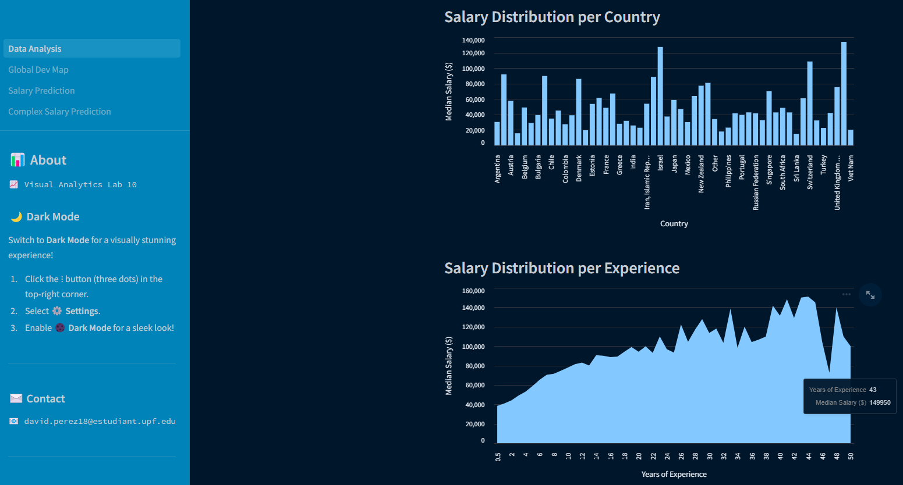
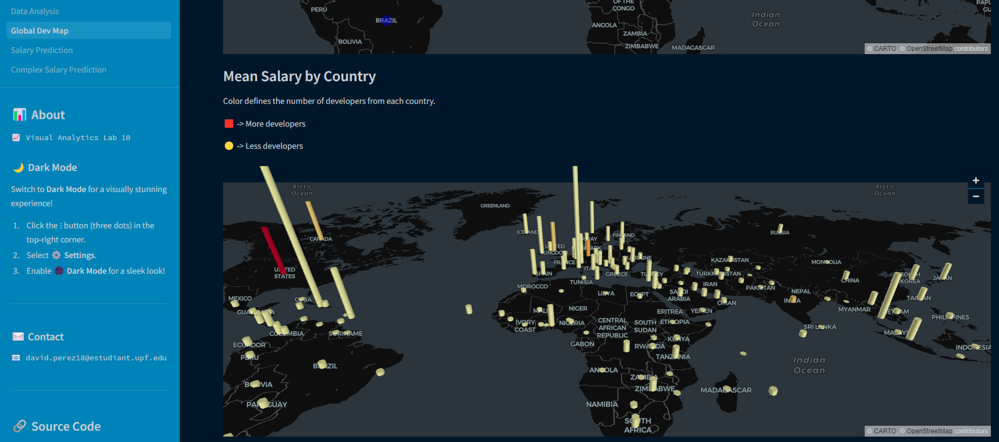
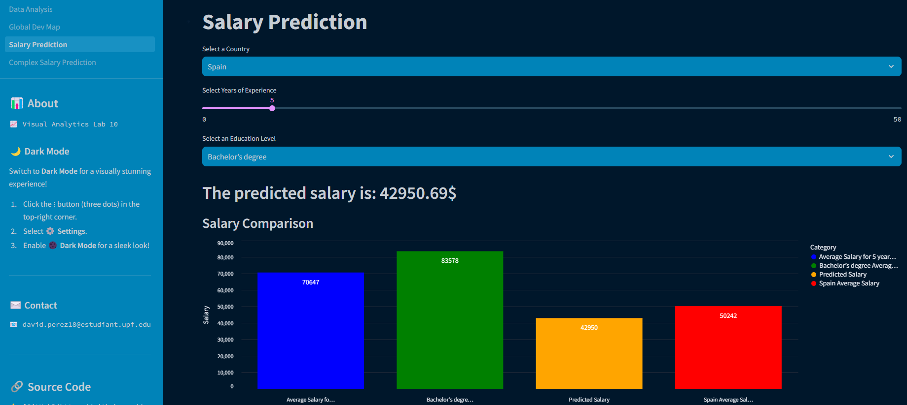

# Visual Analytics Project - Human Resources Consultancy
This project is a web app that provides data analysis and salary prediction for software developers based on the Stack Overflow Annual Developer Survey. The project consists of two main parts:

- A **Jupyter Notebook** that performs exploratory data analysis (EDA), data preparation, and machine learning modeling on the survey data.

- A **Streamlit app** that allows users to interactively explore the data and get salary predictions based on country, education, and experience.

## Features
The web app has the following features:

* **Dashboard:** Shows the distribution of software developers by country, experience, and salary range and contains many diverse EDA visualizations.
* **Interactive Maps:** Two maps display the mean salary and the number of developers for each country.
* **Prediction Tools:**
  - Estimates the salary of a software developer based on their country, education, and experience.
  - Estimates the salary of a software developer based on multiple features.
* **Comparison Tool:** Shows the salary difference between two countries for a given education and experience level and provides more information about your predictions.

## Illustrations







## Installation
To run this project, you need to have Python 3.7 or higher and the following packages installed:

```
pandas
numpy
scikit-learn
streamlit
plotly
geopandas
pickle
pydeck
altair
geopy
matplotlib
```

You also need to download the Stack Overflow Annual Developer Survey data from the zip and save it in the same folder.

## Usage
**Jupyter Notebook:**

Open the Jupyter Notebook in your preferred IDE or use the following command:

```
jupyter notebook Salary_Exploration_Prediction_students.ipynb
```

**Streamlit App:**

Use the following command:

```
streamlit run Data_Analysis.py
```

Then, open your browser and go to the URL shown in the terminal.
